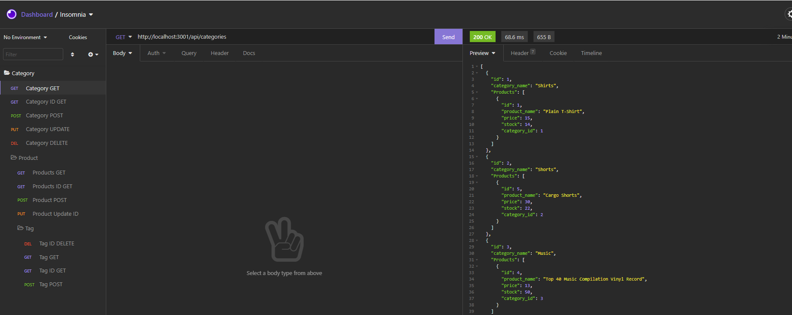

<h1 align="center">E-Commerce Backend</h1>

<!-- TABLE OF CONTENTS -->
<details open="open">
  <summary>Table of Contents</summary>
  <ol>
    <li>
      <a href="#about-the-project">About The Project</a>
      <ul>
        <li><a href="#user-story">User Story</a></li>
      </ul>
       <ul>
        <li><a href="#built-with">Built With</a></li>
      </ul>
    </li>
    <li>
      <a href="#links">Links</a>
    <li><a href="#screenshot">Screenshots</a></li>
  </ol>
</details>

## About The Project

Internet retail, also known as **e-commerce**, is the largest sector of the electronics industry, generating an estimated $29 trillion in 2019. E-commerce platforms like Shopify and WooCommerce provide a suite of services to businesses of all sizes. Due to their prevalence, understanding the fundamental architecture of these platforms will benefit you as a full-stack web developer.

This repository contains the back-end for an e-commerce site that was using Express.js API which was configured to use Sequalize to interact with a MySQL database.

## User Story

```md
GIVEN a functional Express.js API
WHEN I add my database name, MySQL username, and MySQL password to an environment variable file
THEN I am able to connect to a database using Sequelize
WHEN I enter schema and seed commands
THEN a development database is created and is seeded with test data
WHEN I enter the command to invoke the application
THEN my server is started and the Sequelize models are synced to the MySQL database
WHEN I open API GET routes in Insomnia Core for categories, products, or tags
THEN the data for each of these routes is displayed in a formatted JSON
WHEN I test API POST, PUT, and DELETE routes in Insomnia Core
THEN I am able to successfully create, update, and delete data in my database
```

## Built With

- [Javascript](https://www.javascript.com/)
- [Node](https://nodejs.org/en/)
- [Express](https://expressjs.com/)
- [MySQL](https://www.mysql.com/)

## Links

- [Video of Back-End](https://youtu.be/n5PJSmcfeG8)
- [Github Repo](https://github.com/KimShiHyun/Ecommerce-backend)

## Screenshot

The following image shows the web application's appearance and functionality:


